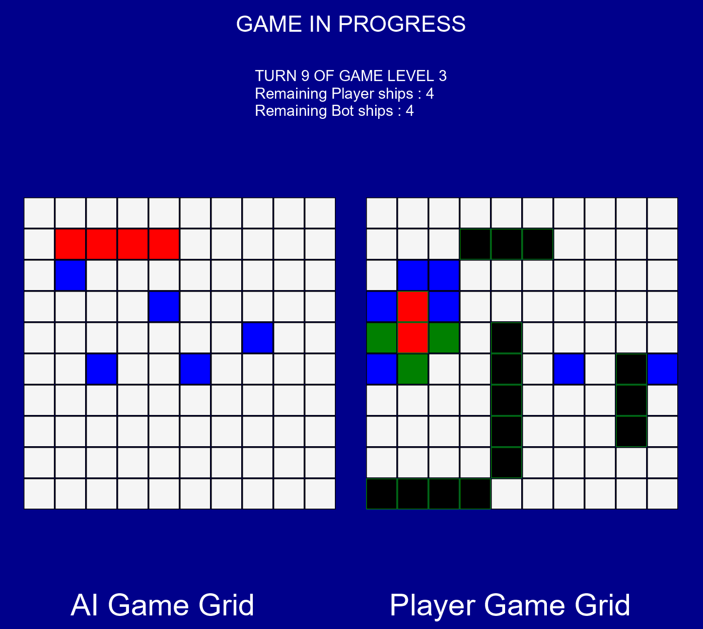

# Java Battleship Game

## Overview
This Java project is a Battleship game implementation. It consists of four main classes: `Bateau` (Ship), `Cellule` (Cell), `Grille` (Grid), and `Main`. The game uses **JavaFX** for the graphical user interface.

## Files Description
- `Bateau.java`: Defines the `Bateau` class, responsible for creating ship objects and their associated methods. It includes attributes for the ship's initial length and orientation.
- `Cellule.java`: Implements the `Cellule` class, which represents the basic component of a grid. It includes methods for handling cell states and interactions with ships.
- `Grille.java`: Represents the game grid using the `Grille` class. This class handles the layout and behavior of the grid, composed of `Cellule` objects.
- `Main.java`: The main driver of the game. It sets up the game environment, including the graphical user interface, using JavaFX.

## Getting Started
To run this game, ensure you have Java and JavaFX installed on your system.

### Prerequisites
- Java JDK 8 or above
- JavaFX SDK

### Running the Game
1. Clone the repository to your local machine.
2. Navigate to the project directory.
3. Compile the Java files: `javac -cp path/to/javafx-sdk/lib --add-modules javafx.controls Bateau.java Cellule.java Grille.java Main.java`
4. Run the Main class: `java -cp path/to/javafx-sdk/lib --add-modules javafx.controls Main`

Note: Modify the paths in the running instructions according to the actual location of your JavaFX SDK.

## Game Instructions
- The game follows the standard Battleship rules.
- Place your ships on the grid and try to sink your opponent's fleet.
- Use the graphical interface to interact with the game.

## Interface

  

<i>*Game interface: Player vs AI*</i>

## Contributing
Feel free to fork the repository and submit pull requests!

## License
This project is licensed under the MIT License - see the LICENSE.md file for details.